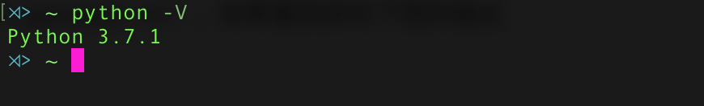

# Python 环境搭建

###  1. 下载安装包

- Windows：

  64位 : https://www.python.org/ftp/python/3.8.1/python-3.8.1-amd64.exe

  32位 : https://www.python.org/ftp/python/3.8.1/python-3.8.1.exe

- MacOS：https://www.python.org/ftp/python/3.8.1/python-3.8.1-macosx10.9.pkg

如果上面的链接下载速度太慢，可以用下面地址：

- Windows：

  64位 : http://maishu.qingke.me/python-3.8.1-amd64.exe

  32位 : http://maishu.qingke.me/python-3.8.1.exe

- MacOS：http://maishu.qingke.me/python-3.8.1-macosx10.9.pkg

### 2. 双击安装


**注意要勾上**```Add Python to PATH```

### 3. 验证安装

1. 打开命令行
   - Windows按Win+R，输入```cmd```后回车
   - macOS打开```Terminal```
   
2. 输入```python -V```并回车（mac可能自带了python2，我们需要输入```python3 -V```），如果看到类似下图的输出结果就说明安装成功！

   


# 常见问题FAQ

> 'python'不是内部或外部命令，也不是可运行的程序或批处理文件

如果在安装时漏选了```Add Python to PATH```就可能会导致这个问题，我们需要手动把Python添加系统的Path环境变量。

##### 解决办法：

**win7**： 右键我的电脑->属性->高级系统配置->高级一栏，在这里打开环境变量->在系统变量PATH加入python的安装路径即可，例如```D:\Python27```

**win10**： 右键win菜单，选择系统->高级系统设置，选择高级一栏，在这里打开环境变量->在系统变量PATH加入python的安装路径即可，例如```D:\Python27```

---

> MacOS 如何将Python命令指向Python3？

MacOS自带了python2，如果我们在命令行运行python，默认使用的是python2，当然你也可以运行命令python3，但是如果你想让python直接指向python3，那么你可以这样做：

1. 打开你用户目录下的.bash_profile文件
2. 在文件的最后加上一行`alias python=/usr/local/bin/python3`，等号后面是python3的安装路径

---

> 如何卸载Anaconda （MacOS）

1. 移除配置，在Terminal里依次运行以下命令：

   ```shell
   conda install anaconda-clean
   anaconda-clean --yes
   ```

2. 移除Anaconda的安装目录，通常在你的用户主目录下，例如：

   ```shell
   rm -rf ~/anaconda3
   ```

3. 移除备份

   ```anaconda-clean --yes```命令会在你的用户目录下创建一个备份目录，以```~/.anaconda_backup/<timestamp>```命名，确保此目录也被删除

4. 清理bash配置文件

   安装Anaconda的时候安装程序可能会在你的```~/.bash_profile```文件里添加了下面两行代码，你也需要删除它们：

   ```shell
   # added by Anaconda3 5.2.0 installer
   export PATH="/Users/abc/anaconda3/bin:$PATH"
   ```


---